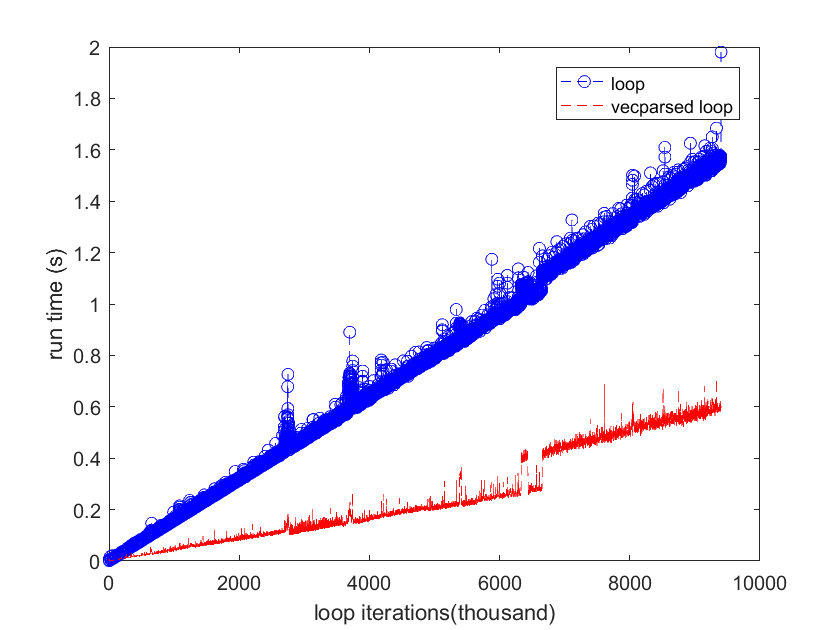

<p align="center">
    
</p>
<div align="center">
    
[](LICENSE)

English | [简体中文](README_zh.md)
</div>
<!-- # Vecparser -->
A parser that auto vectorizes your nested for-loops (in MATLAB, CVX) as much as possible, which is to save tons of run time (97% in some cases). This technique is based on my original post at https://ask.cvxr.com/t/how-to-vectorize-most-constraint-loops-in-cvx/9804 in 2022.

## Table of Contents

- [Quick Start](#quick-start)
- [Example](#example)
- [Performance](#performance)
- [Notice](#notice)
- [Future Work](#future-work)
- [License](#license)
- [Citation](#citation)
- [Acknowledgement](#acknowledgement)
## Quick Start
Run
```bash
git clone https://github.com/jackfsuia/Vecparser.git
```
Then install the requirements, run
```bash
pip install sly
```
To vectorize your for-loops from Matlab and CVX, write your loop (please first read the [Notice](#Notice)) to the [loop_eiditor.m](loop_eiditor.m), then run
```bash
python vecparser.py
```
That's all! The results will be printed in [loop_eiditor.m](loop_eiditor.m) too, please refresh it.

## Example
To vectorize the Matlab loops, copy the loops you want to vectorize to [loop_eiditor.m](loop_eiditor.m), like this one:
```matlab
% loop_eiditor.m
for n1=1:N1
    for n2=1:N2
        for n3=1:N3
            for n4=1:N4
                if n1~=n2*n3 && n3>n4^3
                    x(n1,n2,n3,n4)= (y(n1,n3)+z(n4))*h(n2,n3,n1); % note: size(z) has to be "N4 1", not "1 N4".
                    q(n4,n3,n2,n1)= -h(n2,n3,n1)+((y(n1,n3)+z(n4))*h(n2,n3,n1))^2;
                end
            end
        end
    end
end
```
then run 
```bash
python vecparser.py
```
The result will be appended to [loop_eiditor.m](loop_eiditor.m) as
```matlab
% loop_eiditor.m
for n1=1:N1
    for n2=1:N2
        for n3=1:N3
            for n4=1:N4
                if n1~=n2*n3 && n3>n4^3
                    x(n1,n2,n3,n4)= (y(n1,n3)+z(n4))*h(n2,n3,n1); % note: size(z) has to be "N4 1", not "1 N4".
                    q(n4,n3,n2,n1)= -h(n2,n3,n1)+((y(n1,n3)+z(n4))*h(n2,n3,n1))^2;
                end
            end
        end
    end
end

%-------------------------vectorized by Vecparser as-----------------------

cached_condition_for_this=(permute(repmat(repmat((1:N1)',1,N2,N3)~=permute(repmat(repmat((1:N2)',1,N3).*permute(repmat((1:N3)',1,N2),[2,1]),1,1,N1),[3,1,2]),1,1,1,N4),[2,3,1,4])&permute(repmat(permute(repmat((1:N3)',1,N4),[2,1])>repmat((1:N4)'.^3,1,N3),1,1,N2,N1),[3,2,4,1]));

x=permute(permute((cached_condition_for_this),[4,1,2,3]).*permute((permute(repmat((permute(repmat(y,1,1,N4),[1,3,2])+permute(repmat(z,1,N1,N3),[2,1,3])),1,1,1,N2),[4,3,1,2]).*repmat(h,1,1,1,N4)),[4,1,2,3])+permute((1-permute((cached_condition_for_this),[3,4,1,2])),[2,3,4,1]).*permute(x,[4,2,3,1]),[4,2,3,1]);

q=permute(permute((cached_condition_for_this),[4,1,2,3]).*permute((repmat(-h,1,1,1,N4)+permute(permute((permute(repmat((permute(repmat(y,1,1,N4),[1,3,2])+permute(repmat(z,1,N1,N3),[2,1,3])),1,1,1,N2),[4,3,1,2]).*repmat(h,1,1,1,N4)),[3,4,1,2]).^2,[3,4,1,2])),[4,1,2,3])+permute((1-permute((cached_condition_for_this),[3,4,1,2])),[2,3,4,1]).*permute(q,[1,3,2,4]),[1,3,2,4]);

%-----Please clear this file each time before you write a new loop on------
```
Now copy the results to your matlab to replace the loops, and try them out.

 *Does this help you save some run time? Give us a :star:*
 
## Performance
I ran this performance test on my old computer: Intel(R) Xeon(R) CPU E5-2660 v2 @ 2.20GHz, RAM 16G. Here is what I got:


I also observed that when the loop of iterations is too big, vectorization of it will cause my computer to crash due to memory shortage, therefore it ran slower than traditional loops in those extreme cases. It will be meaningful to see the trade off provided limited RAM, and how it'll perform when GPU come into play.

## Notice
**It might work or not work, it is still a experimental project. For now it only support one if-block or one non if-block in the loop** (*well, the branch [multi_if](https://github.com/jackfsuia/Vecparser/tree/multi_if) might support multi-blocks, test is still being done*). For example, the loop like the following, which has one if-block and one non if-block won't work:
```matlab
for n1=1:N1
    for n2=1:N2
        for n3=1:N3
            for n4=1:N4

                % if block start
                if n1~=n2*n3 && n3>n4^3
                    x(n1,n2,n3,n4)= (y(n1,n3)+z(n4))*h(n2,n3,n1);
                end
                % if block end

                % non if block start
                q(n4,n3,n2,n1)= -h(n2,n3,n1)+((y(n1,n3)+z(n4))*h(n2,n3,n1))^2; % note: size(z) has to be "N4 1", not "1 N4".
                 % non if block end
            end
        end
    end
end
```
but, this loop below that has one non if-block can work:

```matlab
for n1=1:N1
    for n2=1:N2
        for n3=1:N3
            for n4=1:N4
                % non if block start
                x(n1,n2,n3,n4)= (y(n1,n3)+z(n4))*h(n2,n3,n1);
                q(n4,n3,n2,n1)= -h(n2,n3,n1)+((y(n1,n3)+z(n4))*h(n2,n3,n1))^2; % note: size(z) has to be "N4 1", not "1 N4".
                % non if block end
            end
        end
    end
end
```
## Future Work
- Support multiple blocks of if-else in one loop. This may be soon and test on branch [multi_if](https://github.com/jackfsuia/Vecparser/tree/multi_if) has been going on. You can gitve it a try.
- Support reduce operators like `sum`, `norm`, `*`(matrix multiplication).
- Explore its use on other languages (e.g., python)
  
## License

Vecparser is licensed under the Apache 2.0 License found in the [LICENSE](LICENSE) file in the root directory of this repository.

## Citation

If this work is helpful, please kindly cite as:

```bibtex
@article{Vecparser,
  title={Vecparser: a parser that vectorizes your nested for-loops (in MATLAB, CVX) as much as possible.}, 
  author={Yannan Luo},
  year={2024},
  url={https://github.com/jackfsuia/Vecparser}
}
```
## Acknowledgement

This repo uses the matlablexer from [pymatlabparser](https://github.com/jol-jol/pymatlabparser). This repo's [pymatlabparser](pymatlabparser) folder is entirely copied from there with nearly zero modifiacations. Thanks for their wonderful works.
